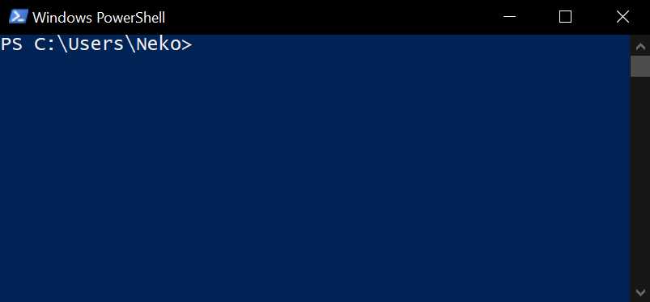
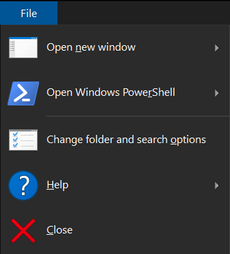
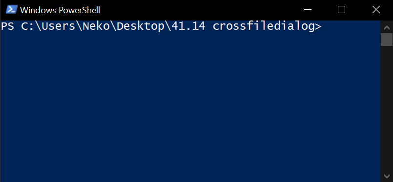

<h1 align="center" style="font-weight: bold">
    Getting Started
</h1>

<div class="toc">
    <h2 id="toc"><b><a href="#toc">Table of Contents</a></b></h2>
    <p>Choose the desired operating system below:</p>
    <ul>
        <li><a href="#windows">Windows</a></li>
        <li><a href="#linux">Linux</a></li>
    </ul>
</div>

<h2 id="windows"><a href="#windows">Windows</a></h2>

1. Follow the instructions at [this link](installing-prerequisites.md#windows) for installing the prerequisites.

2. Replace the "username" and "email" in the following text with your respective username and email you used for registration in Github:

    ```ps1
    git config --global user.name "username"
    git config --global user.email "email"
    ```
    
    Then, copy the resulting text.

2. Press `Windows` + `R` (Press `Windows` and `R` keys simultaneously)

3. A window with a title `Run` should appear. Focus to the said window in the `Open:` text field by hovering the mouse towards the said text field and left-clicking the mouse and type `powershell` as shown below:

    

4. Press `Enter`. A window named `Windows Powershell` should pop-up, as seen in the following:

	

5. Focus to the window named `Windows Powershell` window by hovering the mouse towards the said window and left-clicking the mouse. Then, press `Ctrl` + `V` (Press `Ctrl` and `V` keys simultaneously), and `Enter` afterwards.

    If the window `Windows Powershell` seems to hang up, focus to said window by hovering the mouse towards the said window and left-clicking the mouse, then press `Enter` five times every minute or so until something happens.

6. Follow [this tutorial](https://docs.github.com/en/repositories/creating-and-managing-repositories/cloning-a-repository?platform=windows&tool=webui) from Github to clone this repository.

7. Open the folder where you have cloned the repository in the file explorer. You should see the following:

	 

8. At the upper-right corner of said file explorer window, press the `File` button. You should see the following:

	

9. Press the `Open Windows Powershell` button. A window named `Windows Powershell` should pop-up, as seen in the following:

	

10. Copy the following text:

```sh
just bootstrap
```

    Then, repeat step 5.

Now, you are good to go. Great job!

<h2 id="linux"><a href="#linux">Linux</a></h2>

1. Follow the instructions at [this link](installing-prerequisites.md#linux) for installing the prerequisites. Select your desired Linux distribution.

2. Replace the "username" and "email" in the following text with your respective username and email you used for registration in Github:

    ```sh
    git config --global user.name "username"
    git config --global user.email "email"
    ```

    Then, copy the resulting text.

3. Open your preferred terminal, then press `Ctrl` + `Shift` + `V` (Press `Ctrl`, `Shift`, and `V` keys simultaneously) to paste the command above.

4. Follow [this tutorial](https://docs.github.com/en/repositories/creating-and-managing-repositories/cloning-a-repository?platform=linux&tool=webui) from Github to clone this repository.

5. Open your preferred terminal in the directory in which you cloned this repository, and then run the following command to bootstrap the project:

```sh
just bootstrap
```

Now, you are good to go. Great job!