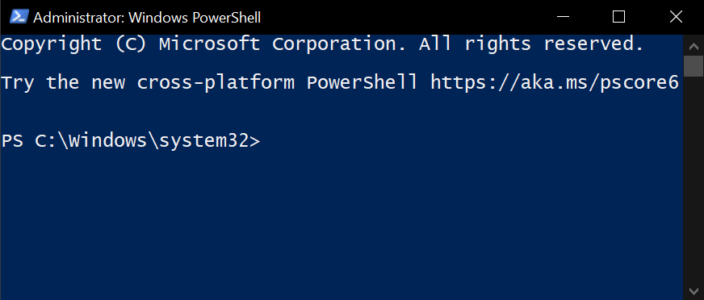

<h1 align="center" style="font-weight: bold">
    Installing Prerequisites
</h1>

<div class="toc">
    <h2 id="toc"><b><a href="#toc">Table of Contents</a></b></h2>
    <p>Choose the desired operating system below:</p>
    <ul>
        <li><a href="#windows">Windows</a></li>
        <li>
            <a href="#linux">Linux</a>
            <ul>
                <li><a href="#linux-debian">Debian</a></li>
                <li><a href="#linux-fedora">Fedora</a></li>
                <li><a href="#linux-arch">Arch</a></li>
            </ul>
        </li>
    </ul>
</div>

<h2 id="windows"><a href="#windows">Windows</a></h2>

1. Copy the following text:

    ```ps1
    Set-ExecutionPolicy Bypass -Scope Process -Force
    [System.Net.ServicePointManager]::SecurityProtocol = [System.Net.ServicePointManager]::SecurityProtocol -bor 3072
    iex ((New-Object System.Net.WebClient).DownloadString('https://community.chocolatey.org/install.ps1'))
    ```

2. Press `Windows` + `R` (Press `Windows` and `R` keys simultaneously)

3. A window with a title `Run` should appear. Focus to the said window in the `Open:` text field by hovering the mouse towards the said text field and left-clicking the mouse and type `powershell` as shown below:

    

4. Press `Ctrl` + `Shift` + `Enter` (Press `Ctrl`, `Shift`, and `Enter` keys simultaneously).

5. A window with a title `User Account Control` should appear as shown below:

    

6. Focus to the said window and press the `Yes` button by hovering the mouse towards the said button and left-clicking the mouse. A window named `Administrator: Windows Powershell` should pop-up, as seen in the following:

	

7. Focus to the window named `Administrator: Windows Powershell` window by hovering the mouse towards the said window and left-clicking the mouse. Then, press `Ctrl` + `V` (Press `Ctrl` and `V` keys simultaneously), and `Enter` afterwards.

    If the window `Administrator: Windows Powershell` seems to hang up, focus to said window by hovering the mouse towards the said window and left-clicking the mouse, then press `Enter` five times every minute or so until something happens.

8. Restart your computer, then login to the user account to which you have done the above instructions at.

9. Copy the following text:

    ```ps1
    choco install -y git just python312
    ```

    Then, repeat step 2-8.

11. Press `Win`. An interface shoud pop up as shown below:

    

12. Search for settings by typing "`Settings`" in the text field as shown below:

    
    
    Press Enter.

13. A window should pop up as shown below:

    
    
    Press "`Apps`" in the selection below.

14. You should be redirected to "`Apps & Features`" as shown below:

    
    
    Below the subtitle "`Apps & Features`", press the hyperlink"`App execution aliases`".

15. You should be redirected to "`App execution aliases`" as shown below:

	

    Toggle the "`App installer`" for both "`python.exe`" and "`python3.exe`". Exit the settings app.

[<- Go back to Getting Started](../../../getting-started.md#windows)

<h2 id="linux"><a href="#linux">Linux</a></h2>

<h3 id="linux-debian"><a href="#linux-debian">Debian</a></h3>

1. Open your preferred terminal and run the following command to install the prerequisites:

    ```sh
    sudo apt update -y
    sudo apt install -y git just python3 python3-pip
    ```

[<- Go back to Getting Started](../../../getting-started.md#linux)

<h3 id="linux-fedora"><a href="#linux-fedora">Fedora</a></h3>

1. Open your preferred terminal and run the following command to install the prerequisites:

    ```sh
    sudo dnf install -y git just python3.12
    ```

[<- Go back to Getting Started](../../../getting-started.md#linux)

<h3 id="linux-arch"><a href="#linux-arch">Arch</a></h3>

1. Open your preferred terminal and run the following command to install the prerequisites:

    ```sh
    sudo pacman -Syyu --noconfirm git just python312
    ```

[<- Go back to Getting Started](../../../getting-started.md#linux)
